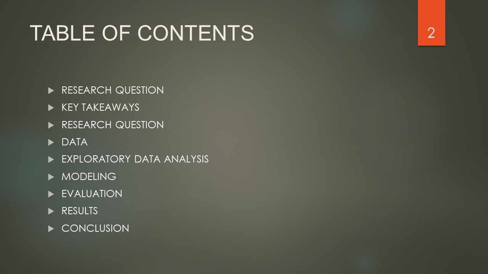

# Power Predictor: Machine Learning Powerlifter

#### [Google Colab File](https://github.com/MarkMinia/Project7/blob/main/Powerlifting_Machine_Learning_Final_KG_Total.ipynb)

##### After attempting the Titanic competition on Kaggle, I decided to run through the process, again, but on the topic of powerlifting because it's a hobby I spend the most time on.

##### My research question is: by using a lifter's basic profile and opening attempt selections, can a machine learning model forecast a lifter's final kg total before that person steps on the platform? 

##### By basic profile, I mean things like age, weight, gender etc.

##### Powerlifting is a sport in which competitors compete to lift the most weight in their specific weightclass. There are three lifts: The squat, bench, and deadlift. You get 3 attempts in each and your best squat, bench, and deadlift numbers are added together to get the final total. So, without looking at 2nd and 3rd attempts, I wanted to see if the opening attempts can be used to predict the final outcome because that is something lifters need to provide to the staff before the competition even begins. Personally, It would also be interesting to see how someone could potentially place in the standings, like 1st, 2nd, or 3rd place.

##### The LGBMR Regressor provided the best results, but not many models were used due to computer issues as Collab kept crashing from runtime errors.

##### From personal experience, I had a feeling this was going to be difficult to predict for a couple reasons, but I was still curious on the results. Some lifters use calculated percentages for picking attempts, some use gut instincts, so that can be a challenge for the model. And if a lifter fails a lift, they often re-attempt it, so they give up the chance to go for a higher total than initially planned. 

##### There's a website called OpenPowerlifting.com that is updated real-time with meets around the world, but the file size was too large. I found one on Kaggle that was half the size, but was still too large for Collab, so I had to upload it using the Kaggle API.

##### I chose to focus on The opening weight attempts, age, weight class, total, gender, event type, equipment used. I kept only SBD (squat, bench, and deadlift) events because I want to predict the total for only full-power events. Rows that are missing under TotalKg is due to the lifter being disqualified from failing their lifts, so I filtered that out, too. 

##### As we grow up we experience a peak in strength, then a natural decline as we age. A younger lifter is more likely to put up a higher total than an older lifter. Also, powerlifting is a high risk sport, but when you're young you can push/pull heavier weights with a faster recovery time.

##### I couldn't fit the entire graph and the x-axis may look a little confusing, but the main idea from looking at bodyweight is that the bigger you are, the easier it is to move the weight, and therefore a higher total is expected, and vice-versa. There are so many powerlifting federations and each one can have their own rulebook regarding how weight classes are created. 

##### Depending on the type of competition, you're allowed specific equipment you can use. Multi-ply and wraps offer the most support during a lift and it can increase a lifter's total by a lot.

##### Steroids are a banned substance only if you enter a drug-tested meet. There's not much to say about it other than it will definitely enhance performance and allow a lifter to put more weight on the bar, if allowed.

##### Gender also plays a role in a lifter's expected kg total. In general, a biological male is expected to lift the heavier weight. Not always the case, but generally speaking based on the data.

##### Finally, the opening attempts.

##### So, after some exploratory data analysis, we get into some prep work. Before the modeling, I filled in the missing values using mean, median, and mode. Then, I split the dataframe, one-hot encoded X and the selected values, and did the Test-Train Split as we have been instructed in past activities. I put it into 4 different regression models: Linear Regression, Bayesian Ridge Regression, LGBM Regressor, and Elastic Net Regression. Then, I evaluated and compared the predictions using the RMSE and R squared. The decision to use only these four was due to Colab repeatedly crashing trying to run the code.

##### The RMSE tells me how far the predicted values are from the actual values, and the R Squared evaluates the scatter of the data points with a 1 being a perfect model. Based on the results, the LGBM Regressor was the best in predicting the totals amongst the four, but would not be applicable in a real-life competition. I preferebly would want a lower RMSE, ideally down to 25-50. One red calibrated weighted plate is 25kg, and one on each side of the bar makes 50kg, so I can accept the model if the difference between predicted and actual values are off by 1-2 plates.

